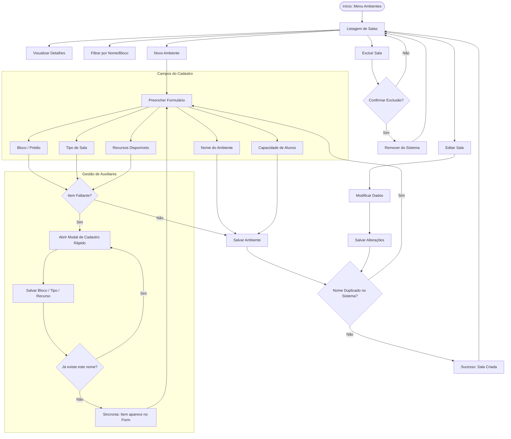

# Documentação Técnica: Gestão de Ambientes 🏢🎯🚀

## 1. Visão Geral

O módulo de **Gestão de Ambientes** é um pilar fundamental do sistema Escola Conectada. Ele permite a organização estrutural da instituição, definindo onde as atividades ocorrem, qual a capacidade dos espaços e quais recursos estão disponíveis.

Esta documentação detalha as funcionalidades, processos técnicos e as decisões de design que tornam este módulo robusto e intuitivo.

---

## 2. Funcionalidades Principais

### 2.1. Listagem e Consulta

- **Visualização Dinâmica:** Tabela interativa com estatísticas rápidas de ocupação (em desenvolvimento).
- **Filtros Inteligentes:** Pesquisa em tempo real por nome ou bloco.
- **Ações Rápidas:** Atalhos para edição, exclusão e visualização de detalhes.

### 2.2. Cadastro de Ambientes

O formulário de cadastro foi construído utilizando **Angular Reactive Forms**, garantindo validação em tempo real e uma experiência sem erros.

- **Dados Coletados:** Nome, Bloco/Prédio, Tipo de Sala (Auditório, Laboratório, etc), Capacidade e Recursos.
- **Validação de Duplicidade:** O sistema impede a criação de duas salas com o mesmo nome dentro da mesma escola, evitando confusão administrativa.

### 2.3. Gestão de Auxiliares (Modais de Configuração)

Para maximizar a produtividade, o usuário pode cadastrar novos **Blocos**, **Categorias** ou **Recursos** sem sair da tela de cadastro de salas.

- **Fluxo Ininterrupto:** Modais rápidos para criação de dependências.
- **Sincronia Automática:** Novos itens criados nos modais aparecem instantaneamente nos seletores do formulário principal.

---

## 3. Fluxograma de Funcionamento 🔄

O diagrama abaixo detalha o fluxo operacional das funcionalidades de Gestão de Ambientes:

---

## 4. Sistema de Onboarding (Tutorial Interativo) 🎓✨

O diferencial deste menu é o seu sistema de ajuda guiada, migrado para a tecnologia **Ngx-UI-Tour (MdMenu)**.

### Os "Porquês" da Engenharia de Onboarding:

- **Ngx-UI-Tour vs Driver.js:** Migramos para o Ngx-UI-Tour para obter uma integração nativa com o Angular Material, permitindo que os balões de ajuda flutuem perfeitamente sobre menus e botões do sistema.
- **Estabilidade Quântica (Quantum Shield):** Implementamos um mecanismo de _retry_ assíncrono. Se o tutorial tentar destacar um elemento que ainda está sendo renderizado pelo Angular (como um botão dentro de um modal), o sistema espera micro-segundos e tenta novamente, garantindo que o tutorial nunca trave.
- **Z-Index Layering (Nível 10000):** Para evitar que sombras ou outros modais fiquem na frente do tutorial, elevamos toda a interface de ajuda para a camada máxima (`10000`).

---

## 5. Design UI/UX 🎨

### Seleção de Recursos (Pills)

As pílulas de recursos foram desenhadas para serem táteis e visualmente claras:

- **Centralização Precisa:** Ícones e textos perfeitamente alinhados via Flexbox.
- **Micro-interações:** Feedback visual ao passar o mouse (hover) e ao selecionar.
- **Compactação:** Design otimizado para não ocupar espaço excessivo, mantendo a legibilidade.

---

## 7. Integridade de Dados e Multi-tenancy 🛡️🔐

Para garantir que cada escola tenha dados isolados e consistentes, implementamos camadas de proteção de nível industrial:

- **Proteção 3-Camadas (Single Name Policy):**
  1.  **Frontend:** Bloqueio reativo no formulário para feedback instantâneo.
  2.  **Backend (Handlers):** Validação lógica antes da persistência para garantir integridade via API.
  3.  **Banco de Dados (Postgres):** Índices `UNIQUE` compostos por `TenantId` e `Nome`, servindo como a última e intransponível linha de defesa.
- **Isolamento Dinâmico (Per-Query Evaluation):** O sistema utiliza um middleware que identifica a escola logada e aplica automaticamente um filtro (`WHERE TenantId = X`) em todas as consultas SQL, garantindo que um administrador nunca veja dados de outra instituição.

---

## 8. Arquitetura Técnica 🏗️

| Componente          | Responsabilidade                                           |
| :------------------ | :--------------------------------------------------------- |
| `CadastroSala`      | Gerenciamento de estado do formulário e modais auxiliares. |
| `ConsultaSala`      | Listagem, filtragem e orquestração de ações em lote.       |
| `SalaService`       | Comunicação com a API REST (Repository Pattern).           |
| `SchoolDataService` | State Management compartilhado para dados da escola.       |
| `TutorialService`   | Core de lógica do tour interativo e blindagem estrutural.  |

---

## 9. Conclusão

A Gestão de Ambientes é um ecossistema projetado para ser **rápido**, **à prova de erros** e **educativo**. A combinação de validações robustas no frontend com um sistema de tutorial de alta tecnologia e proteção de dados em nível de banco de dados garante uma base sólida para a organização escolar.

---

_Documentação técnica atualizada para refletir as proteções de unicidade e multi-tenancy - 2026_
